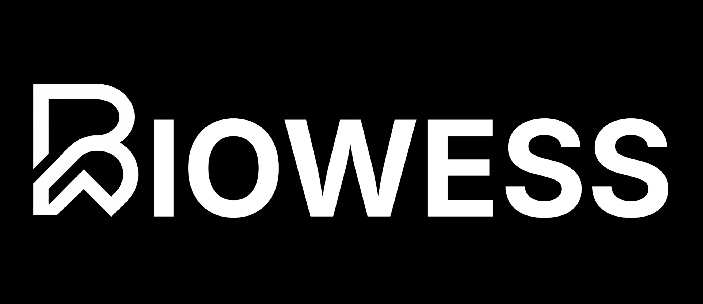

<div align="center">
  
</div>

<br />

<div align="center">

# Open-Source Medical Educational Software
**Biowess publishes experimental tools for students and developers building at the intersection of medicine and software.**

[](#)
[](#)
[](#)

</div>

---

## ✦ Core Mandate

Biowess is an independent, open-source studio focused on creating non-diagnostic, purely educational medical software. We build experimental tools tailored for medical students, bioinformatics learners, and developers exploring healthcare software systems.

**What we are NOT:**
- ✖ A startup or SaaS product
- ✖ A diagnostic tool
- ✖ A clinical decision support system
- ✖ A patient data platform

---

## ✦ Published Applications

### [Aletheia](#)
**Clinical Workstation (Educational)**  
An open-source educational clinical workstation for simulating patient data workflows. Built to give medical students and clinical software learners a safe sandbox for exploring medical information systems.
- **Status:** Active
- **Tags:** `Educational` `Clinical` `Simulation`

### [HematoX](#)
**Hematology AI Application**  
A hematology-focused AI educational tool for exploring blood panel interpretation patterns. Designed for medical students and bioinformatics learners interested in the intersection of artificial intelligence and hematology.
- **Status:** Active
- **Tags:** `Educational` `Hematology` `AI`

---

## ✦ Technical Architecture

This repository contains the source code for the main Biowess website, built with modern web technologies adhering to a strict, monochrome design system.

- **Framework:** Next.js (App Router)
- **Styling:** Tailwind CSS + Custom CSS Variables
- **Typography:** IBM Plex Sans & IBM Plex Mono
- **Design Philosophy:** Utilitarian, grayscale-only, glassmorphism layers, and deep focus on typography and layout architecture.

### Getting Started

To run the development server locally:

```bash
# Install dependencies
npm install

# Start the development server
npm run dev
```

Open [http://localhost:3000](http://localhost:3000) with your browser to see the result.

---

## ✦ Disclaimer

> **IMPORTANT:** All Biowess applications and tools are strictly **non-diagnostic** and intended for **educational purposes only**. 
> They are not medical devices, do not provide clinical advice, and must never be used for patient care or diagnostic decisions.

---

<div align="center">
  <p>Biowess is an independent project built by a medical student.</p>
  <p><b>© 2026 Biowess. Custom Source-Available License 1.0.</b></p>
</div>
